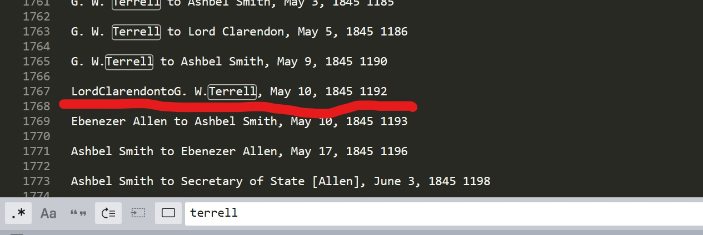
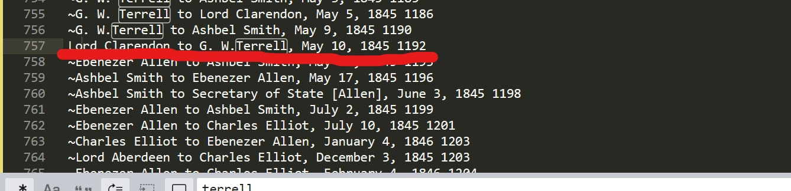
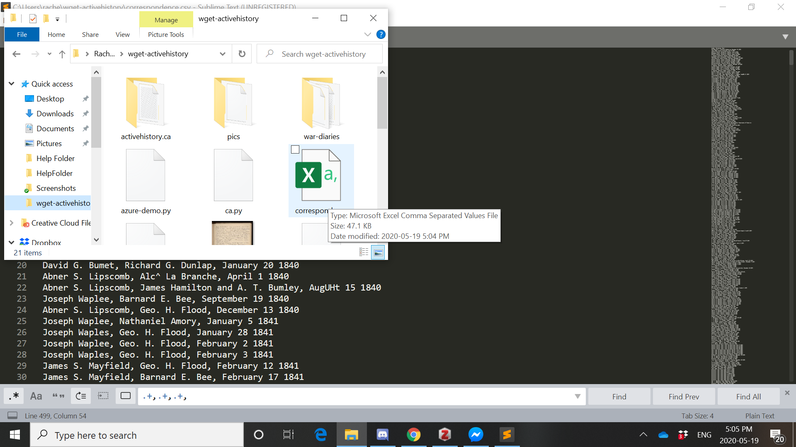
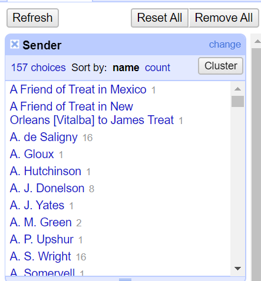
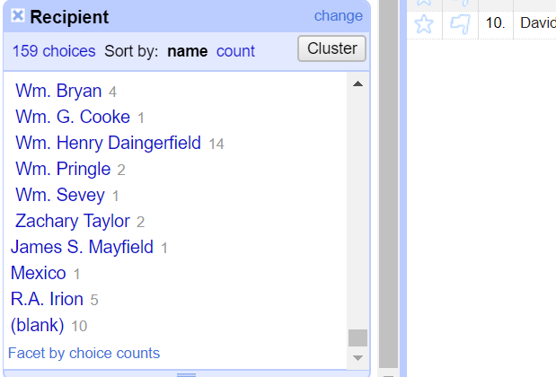

# Evidence for Week Three

## REGEX

- Not entirely sure why but replacing \n[^~.+] with \n only took away some of the material that wasn't letters. I had to run it a second time for them all to be gone

- Instead I used \n[^~]+ replaced with \n which worked in one try

- I used the search function in both the original file and the condensed file to fix this line ...

   - I could tell there was a 'to' in the line and therefore ould be considered a letter; however, there was a typo in spacing that didn't allow for this 'to' to come up as a search result. Thus, I fixed it manually.

- I did all of the first steps of work and realized that I had accidentally deleted the beginning of each line. Not knowing how to undo this mistake, I grudgingly had to start over

- The second time I was successful

## Open Refine

- I got my results after merging and re-clustering senders down to 157

- I got my results after merging and re-clustering recipients down to 159

