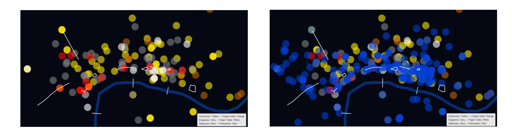
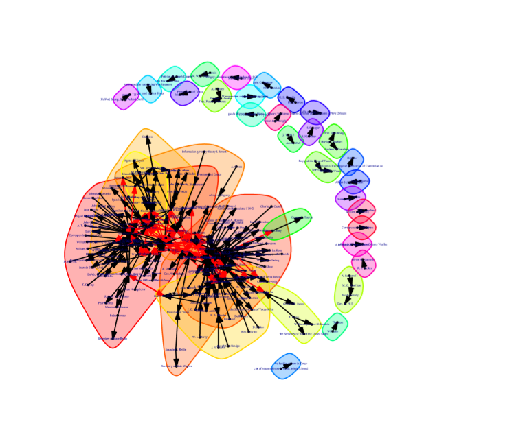

# Reflection for Week Three

This week I learned a lot about the tidying of data and the visualizations of digital history projects. The data analysis and reformation is part of what James Barker refers to as "soft history". This is the work that defines the final digital work, but is not itself part of that final work. 

Performing this "soft history" is an integral part of the digital history process. For Barker's project on the making and selling of satirical prints in London in the late-eighteenth and early-nineteenth centuries, he says his process of mapping the businesses associated with the prints gave him a sense of what he cared to produce in his project. This is such as when I was playing around with the different networking toold on Gephi and RStudio. Each plot visualizes uniquely and thus prioritizes different information. 

Barker created two visualizations which I will show below. In the one the blue dots representing the stationers are everywhere. Barker commentd what he noticed "was that I could not see any patterns because the stationers dominated the visual field." Using different variations and visualization techniques allow different patterns to appear. Without the starioners, Barker was able to identify a relationship. 

- The image on the left is without the stationers. THe image on the right shows the stationers in blue.

The soft history started before I created any visualizations. Using REGEX in Sublime, and Open Refine, I went through and tidied up the data. This is where my assumptions (me being the digital historian) began. We wanted to look at letters and so we went on the assumption that all letters would have the word "to" in the line. But there is a chance that there was a letter that did not contain the word "to" in the line. Or that there was the word "to" in a line that was not a letter.  

For example, I found a line in the document of a letter from Lord Clarendon to G.W. Terrell on May 10, 1845. However, a typo eliminated the spaces between the name Lord Clarendon, the word "to", and the first letter in Terrell's name "G". If I had jsut used the REGEX, I would not have caught this because the "to" would have appeared to be inside a word. I caught this by a quick glance through the data before I started with REGEX.

I made more assumptions while using Open Refine to cluster the senders and recipients. It was evident that there were some typs in the data and therefore grouping of names was possible in the assumption that it was the same person. But we don't know for sure it is the same person. In addition, there could be groupings that I overlooked.

But as Barker comments, this process is integral to the flow of thinking of the historian. It does not really matter whether I missed a grouping or made a false grouping, if I a not making a direct argument in regards to it. 

As for the "hard history" - as Barker refers to the material that made it into his book - this is where the historian's agency comes into play. This is about the argument that the individual historian wants to convey, and the material that supports this argument. Thus, one could say that there is a bit of bias in terms of the history that makes it into the final product. This is technically not wrong, but I see it as more of an act of historical agency. 

However, there could be some value to publishing this so called "soft history". While it might not be directly related to the argument we come back to Barker's comment that the "soft history" helps the historian through their thinking. If these thought patterns are made known to the public, the final work might have a greater effect. 

From a scholarly standpoint, showing your work not only helps prove your point but it shows that you understand the process. Digital history is not easy. This week I had many struggles using REGEX and various networks. As I worked through each activity, I began to get the hang of the various programs (except Gephi would not open for me - it said I did not have a Java script but I made sure Java was downloaded and that I had the newest version running). Even though I started to get the hang of how to do the work, if I am being completely honest I still am struggling to understand the final product. 

Looking at the visualizations that I created in RStudio I have no clue what I am looking at. I am still working through understanding how a simple chart of senders and receivers has created such a complex plot. What I do understand is that little changes in the data can cause large changes in the plot. This comes back to the point about making assumptions.

It is impossible to show all your work as a historian - digital or not. For example, in a history course I took last year, I wrote a paper dealing with a particular newspaper column. While I read dozens of these colums, I did not publish them all with my work (yes I cited them but not a single one was there for a full read). This is becasue it is again the argument of the historian that is to be brought out. The intention of this work is not to publish a primary source and let the general population make of it what they want - although, this is seemingly more popular with digital work. 
