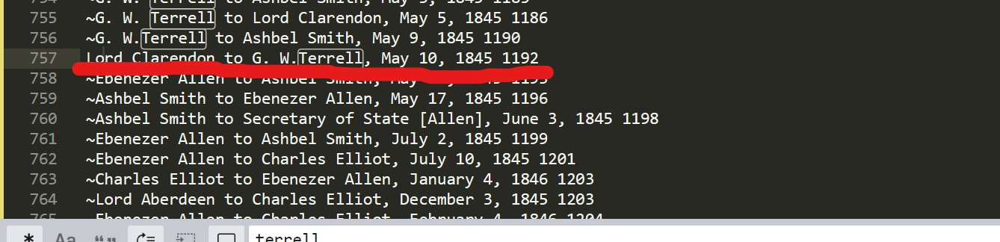

# Reflection for Week Three

This week I learned a lot about the tidying of data and the visualizations of digital history projects. The data analysis and reformation is part of what James Barker refers to as "soft history". This is the work that defines the final digital work, but is not itself part of that final work. 

Performing this "soft history" is an integral part of the digital history process. For Barker's project on the making and selling of satirical prints in London in the late-eighteenth and early-nineteenth centuries, he says his process of mapping the businesses associated with the prints gave him a sense of what he cared to produce in his project. This is such as when I was playing around with the different networking toold on Gephi and RStudio. Each plot visualizes uniquely and thus prioritizes different information. 

Barker created two visualizations which I will show below. In the one the blue dots representing the stationers are everywhere. Barker commentd what he noticed "was that I could not see any patterns because the stationers dominated the visual field." Using different variations and visualization techniques allow different patterns to appear. Without the starioners, Barker was able to identify a relationship. 

- The image on the left is without the stationers. THe image on the right shows the stationers in blue.

The soft history started before I created any visualizations. Using REGEX in Sublime, and Open Refine, I went through and tidied up the data. This is where my assumptions (me being the digital historian) began. We wanted to look at letters and so we went on the assumption that all letters would have the word "to" in the line. But there is a chance that there was a letter that did not contain the word "to" in the line. Or that there was the word "to" in a line that was not a letter.  

For example, I found a line in the document of a letter from Lord Clarendon to G.W. Terrell on May 10, 1845. However, a typo eliminated the spaces between the name Lord Clarendon, the word "to", and the first letter in Terrell's name "G". If I had jsut used the REGE, I would not have caught this because the "to" would have appeared to be inside a word. I caught this by a quick glance through the data before I started with REGEX.

